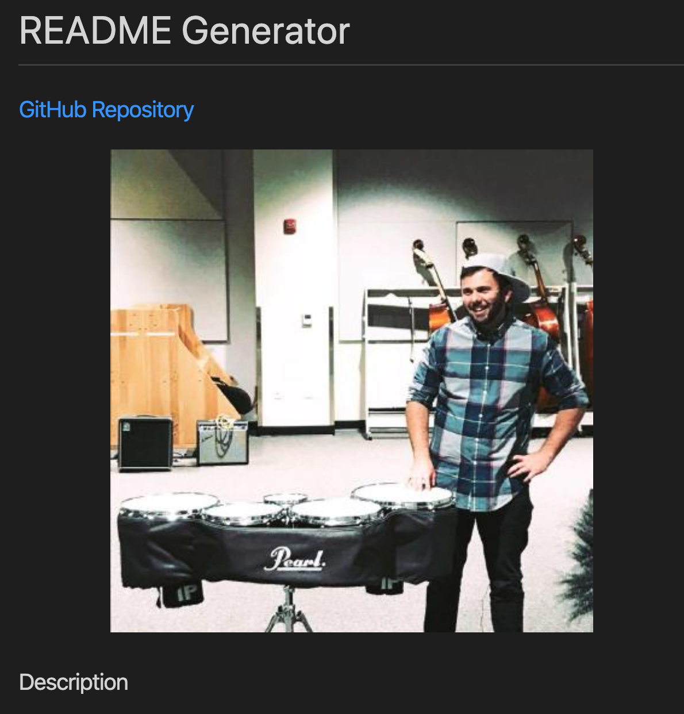
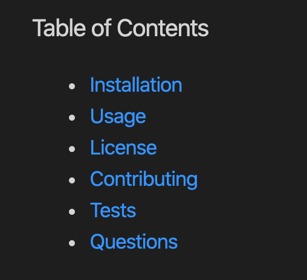

# README Generator

### [GitHub](https://github.com/Colin-Whitcomb) Repository Link

 

 Final Product Preview
 

    

    
## Summary & Process
For this project, our objective was to create an app that dynamically generates READmes with Node.js commands. I made sure to include all required elements including links to GitHub repos, url request for GitHub profile picture, GitHub Badge, and table of contents. 

This READme is an adaptation from the result.
_______
## Table of Contents

* [Technologies Used](#technologies_used)

* [Contact](#contact)
    
## Generated READme Screen Shots 

    

    

____
## Technologies_Used

- Node.js / Javascript 
- Visual Studio Code
- Git / GitHub / GitPages
   

## Contact

* [Colin Whitcomb](https://github.com/Colin-Whitcomb)
* [Email](csammyw@gmail.com)
* [LinkedIn](https://www.linkedin.com/in/colin-whitcomb-b808301a6/)
* [Portfolio](https://colin-whitcomb.github.io/Portfolio/)